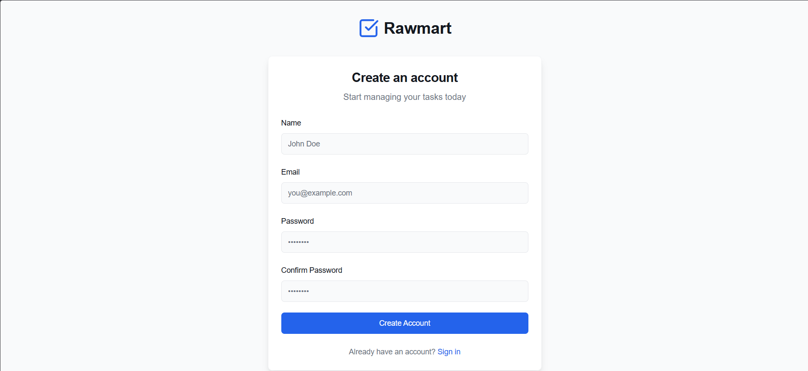
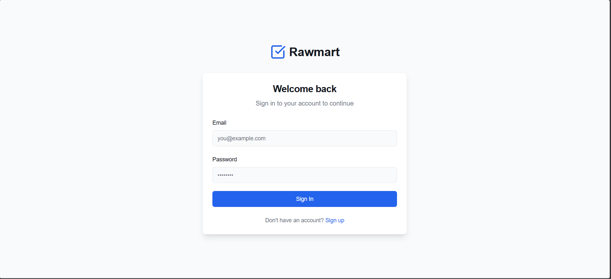
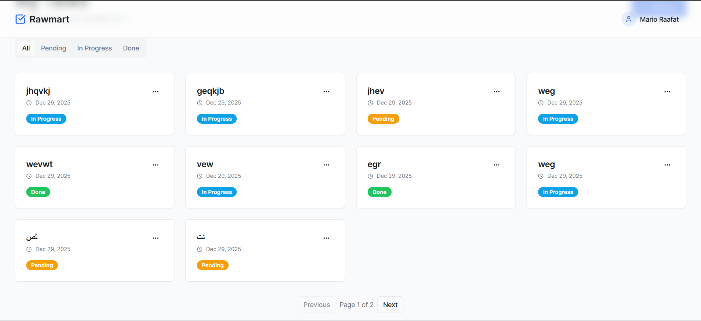
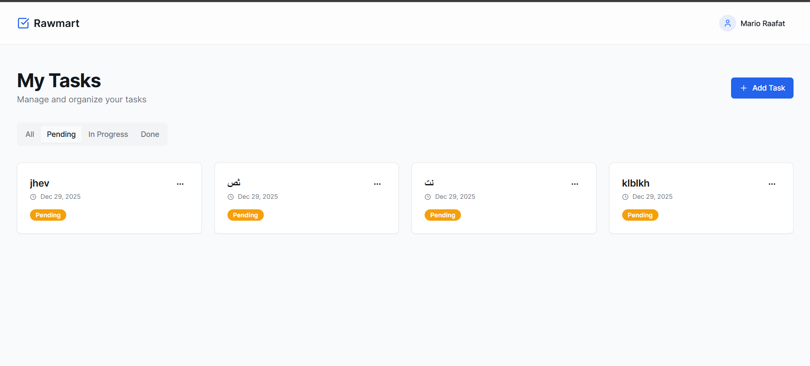

# Rawmart Assessment - Task Management Application

A full-stack task management application featuring a modern React frontend and a robust Laravel backend.

## Setup Instructions

### Prerequisites
- **Node.js**: v18 or higher
- **PHP**: v8.2 or higher
- **Composer**
- **SQLite** (usually included with PHP)

### Backend Setup (Laravel)
1. Navigate to the backend directory:
   ```bash
   cd Backend
   ```
2. Install PHP dependencies:
   ```bash
   composer install
   ```
3. Configure the environment:
   - Copy `.env.example` to `.env`:
     ```bash
     cp .env.example .env
     ```
   - **Note**: The project is pre-configured to use **SQLite** for simplicity. Ensure `DB_CONNECTION=sqlite` is set in your `.env`.
4. Generate the application key:
   ```bash
   php artisan key:generate
   ```
5. Run database migrations:
   ```bash
   php artisan migrate
   ```

### Frontend Setup (React + Vite)
1. Navigate to the frontend directory:
   ```bash
   cd Frontend/rawmart
   ```
2. Install JavaScript dependencies:
   ```bash
   npm install
   ```

---

## How to Run the Project

You need to run both the backend and frontend servers simultaneously (in separate terminal windows).

### 1. Start Backend Server
```bash
cd Backend
php artisan serve --host=127.0.0.1 --port=8000
```
> The API will be available at http://127.0.0.1:8000/api

### 2. Start Frontend Development Server
```bash
cd Frontend/rawmart
npm run dev
```
> The application will be accessible at http://localhost:5173 (or the URL shown in your terminal).

---

## API Endpoints

The backend provides a RESTful API for authentication and task management.

### Authentication
| Method | Endpoint | Description |
|--------|----------|-------------|
| POST | `/api/auth/register` | Register a new user |
| POST | `/api/auth/login` | Log in and receive a token |
| POST | `/api/auth/logout` | Log out the current user |
| GET | `/api/auth/me` | Get current user profile |

### Tasks
| Method | Endpoint | Description |
|--------|----------|-------------|
| GET | `/api/tasks` | Get paginated tasks. Supports `page`, `limit` (default 10), and `status` query params. |
| POST | `/api/tasks` | Create a new task |
| GET | `/api/tasks/{id}` | Get a specific task by ID |
| PUT | `/api/tasks/{id}` | Update a task |
| DELETE | `/api/tasks/{id}` | Delete a task |

---

## Assumptions Made
- **Database**: Used **SQLite** to ensure the project works out-of-the-box without requiring a complex PostgreSQL/MySQL installation.
- **Environment**: Assumed a local development environment (Windows/Linux/Mac) with standard ports (8000 for API).
- **Security**: Used Laravel Sanctum for API token authentication and standard React Route protection for the frontend.

---

## 🐳 Docker Setup

The project includes Docker support for a consistent development environment.

### Prerequisites
- **Docker Desktop** installed and running.

### How to Run with Docker
1. From the project root, run:
   ```bash
   docker-compose up --build
   ```
2. Access the application:
   - **Frontend**: http://localhost:5173
   - **Backend API**: http://localhost:8000/api

---

## Bonus Features & Implementation Status

| Feature | Status | Notes |
|---------|--------|-------|
| **Pagination** | ✅ Done | Implemented on both backend (customizable limit) and frontend. |
| **Protected Routes** | ✅ Done | Frontend routes are guarded; unauthenticated users are redirected to login. |
| **Filtered Views** | ✅ Done | Filter tasks by status (Pending, In Progress, Done) with server-side queries. |
| **Docker Setup** | ✅ Done | `Dockerfile`s and `docker-compose.yml` added. |
| **Basic Tests** | ✅ Done | Feature tests for Task CRUD operations added in `tests/Feature/TaskApiTest.php`. |
| **Deployment** | ❌ Todo | Deployment link not yet available. |

---

## Screenshots

### Sign Up


### Sign In


### Tasks Dashboard


### Filtered Tasks (Pending)
